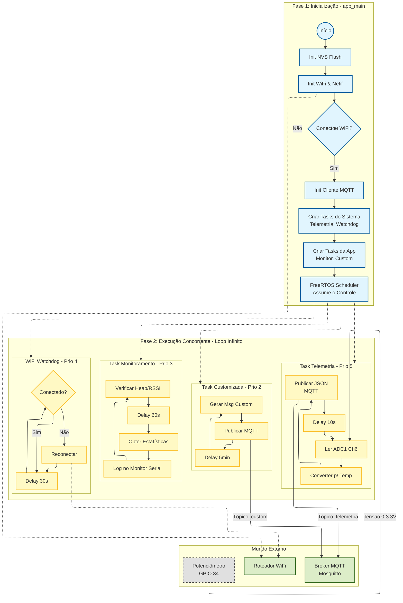

# Sistema IoT MQTT para ESP32 📡

Sistema completo de comunicação IoT baseado em MQTT para ESP32, desenvolvido com ESP-IDF. Arquitetura modular, bem documentada e pronta para uso em projetos profissionais.

## 🎯 Características

- ✅ **Arquitetura Modular**: Separação clara entre biblioteca (mqtt_system) e aplicação (main)
- ✅ **Inicialização Robusta**: Tratamento de erros em cada fase de inicialização
- ✅ **Reconexão Automática**: WiFi e MQTT reconectam automaticamente em caso de falha
- ✅ **Telemetria Integrada**: Sistema automático de publicação de dados de sensores
- ✅ **Health Monitoring**: Monitoramento contínuo de métricas vitais do sistema
- ✅ **Estatísticas Detalhadas**: Contadores e métricas para debug e monitoramento
- ✅ **API Limpa e Documentada**: Interface pública bem definida e documentada
- ✅ **Código Didático**: Comentários extensivos explicando cada conceito

## Fluxograma



## 📁 Estrutura do Projeto

```text
mqtt-iot-system/
├── main.c                 # Aplicação principal (lógica de negócio)
├── mqtt_system.h          # Interface pública da biblioteca
├── mqtt_system.c          # Implementação da biblioteca
├── CMakeLists.txt         # Configuração de build
└── README.md              # Esta documentação
```

### Arquivos Principais

#### `mqtt_system.h` - Interface Pública

Define a API pública do sistema MQTT:

- Tipos e estruturas (estatísticas, telemetria, health)
- Funções de inicialização e controle
- Funções de publicação e subscrição
- Macros de configuração
- Tópicos MQTT padrão

#### `mqtt_system.c` - Implementação

Implementa toda a lógica interna:

- Inicialização de subsistemas (NVS, WiFi, MQTT)
- Handlers de eventos (WiFi e MQTT)
- Tasks de telemetria e monitoramento
- Funções auxiliares e privadas

#### `main.c` - Aplicação

Arquivo principal da sua aplicação:

- Chama `mqtt_system_init()` para inicializar tudo
- Implementa lógica específica da aplicação
- Usa API pública para interagir com MQTT

## 🚀 Como Usar

### 1. Configuração para rodar no emulador

1. Abra o terminal do PlatformIO.
2. Execute:

   ```bash
   pio run -t menuconfig
   ```

3. Navegue e altere:
   - Watchdog: Component config -> ESP System Settings -> Task Watchdog timeout period (seconds) -> Mude para 20.
   - PHY: Component config -> PHY -> Desmarque a opção Store PHY calibration data in NVS.
4. Salve (Q) e saia. O arquivo sdkconfig será atualizado automaticamente.

### 2. Configuração Inicial do software

Configure as credenciais WiFi e MQTT em `mqtt_system.h` ou via menuconfig:

```c
#define CONFIG_WIFI_SSID      "SuaRedeWiFi"
#define CONFIG_WIFI_PASSWORD  "SuaSenha"
#define CONFIG_MQTT_BROKER_URI "mqtt://10.0.2.2:1883"
```

### 3. Inicialização Simples

No seu `app_main()`, basta uma chamada:

```c
void app_main(void)
{
    // Inicializa TUDO: WiFi, MQTT, tasks, etc
    esp_err_t ret = mqtt_system_init();
    
    if (ret != ESP_OK) {
        ESP_LOGE(TAG, "Falha na inicialização");
        return;
    }
    
    // Seu código aqui...
}
```

### 4. Publicar Dados

#### Publicação Genérica

```c
mqtt_publish_data("meu/topico", "meus dados", 0, 1, false);
```

#### Publicação de Telemetria Estruturada

```c
telemetry_data_t data = {
    .temperatura = 25.5,
    .umidade = 60.0,
    .contador = 123,
    .timestamp = esp_timer_get_time() / 1000ULL
};

mqtt_publish_telemetry(&data);
```

#### Publicação de Health Check

```c
mqtt_publish_health_check();
```

### 4. Subscrever em Tópicos

```c
// Subscrever com QoS 1
mqtt_subscribe_topic("comandos/irrigacao", 1);

// Subscrever com wildcard
mqtt_subscribe_topic("sensores/+/temperatura", 0);
```

### 5. Obter Estatísticas

```c
mqtt_statistics_t stats;
mqtt_get_statistics(&stats);

ESP_LOGI(TAG, "Mensagens publicadas: %lu", stats.total_publicadas);
ESP_LOGI(TAG, "Mensagens recebidas: %lu", stats.total_recebidas);

// Ou imprimir tudo
mqtt_print_statistics();
```

### 6. Verificar Status

```c
if (mqtt_system_is_connected()) {
    // MQTT está conectado, pode publicar
} else {
    // Desconectado, sistema tentará reconectar automaticamente
}
```

## 📊 Tópicos MQTT Padrão

O sistema define tópicos padrão para funcionalidades comuns:

| Tópico                    | Descrição             | QoS | Retain |
| ------------------------- | --------------------- | --- | ------ |
| `demo/central/status`     | Status online/offline | 1   | ✅      |
| `demo/central/telemetria` | Dados de sensores     | 1   | ❌      |
| `demo/central/health`     | Métricas de saúde     | 0   | ❌      |
| `demo/central/comandos`   | Recebe comandos       | 1   | ❌      |
| `demo/central/boot`       | Info de inicialização | 1   | ❌      |

## 🔧 Configurações Avançadas

### Ajustar Intervalos

Edite as constantes em `mqtt_system.h`:

```c
#define TELEMETRY_INTERVAL_MS      10000   // Telemetria a cada 10s
#define HEALTH_CHECK_INTERVAL_MS   60000   // Health a cada 1 min
#define WIFI_WATCHDOG_INTERVAL_MS  30000   // Watchdog a cada 30s
```

### Ajustar Buffers MQTT

```c
#define MQTT_BUFFER_SIZE           2048    // Tamanho do buffer
#define MQTT_KEEPALIVE_SEC         60      // Keep-alive
#define MQTT_TIMEOUT_MS            10000   // Timeout de operações
```

## 📈 Funcionalidades Automáticas

### Tasks em Background

O sistema cria automaticamente 3 tasks:

1. **Telemetria Task** (prioridade 5)
   - Publica dados de sensores periodicamente
   - Formato JSON estruturado
   - QoS 1 para garantir entrega

2. **Health Monitoring Task** (prioridade 3)
   - Monitora heap, WiFi RSSI, uptime
   - Publica health checks periodicamente
   - Alertas quando memória baixa

3. **WiFi Watchdog Task** (prioridade 4)
   - Verifica conexão WiFi continuamente
   - Reconecta automaticamente se desconectado
   - Essencial para redes instáveis

### Last Will Testament

Configurado automaticamente:

- Tópico: `demo/central/status`
- Mensagem: `offline`
- QoS: 1, Retain: true

Se ESP32 desconectar abruptamente, broker publica automaticamente "offline".

## 🐛 Debug e Troubleshooting

### Aumentar Nível de Log

No menuconfig:

```text
Component config → Log output → Default log verbosity → Debug
```

Ou no código:

```c
esp_log_level_set("MQTT_SYSTEM", ESP_LOG_DEBUG);
```

### Verificar Estatísticas

```c
mqtt_print_statistics();
```

Saída:

```text
=== Estatísticas MQTT ===
Publicadas   : 152
Recebidas    : 23
Falhas       : 3
Desconexões  : 1
Tempo offline: 5432 ms
========================
```

### Problemas Comuns

**WiFi não conecta:**

- Verifique SSID e senha em `CONFIG_WIFI_SSID` e `CONFIG_WIFI_PASSWORD`
- Verifique se rede suporta WPA2-PSK
- Aumente `WIFI_MAX_RETRY` se rede é instável

**MQTT não conecta:**

- Verifique URI do broker em `CONFIG_MQTT_BROKER_URI`
- Teste broker com `mosquitto_sub -h broker.hivemq.com -t '#'`
- Verifique firewall/porta 1883

**Memória insuficiente:**

- Reduza `MQTT_BUFFER_SIZE`
- Reduza stack size das tasks em `create_tasks()`
- Verifique vazamentos com `esp_get_free_heap_size()`

## 📚 API Completa

### Inicialização

- `mqtt_system_init()` - Inicializa sistema completo
- `mqtt_system_shutdown()` - Desliga graciosamente
- `mqtt_system_is_connected()` - Verifica status de conexão

### Publicação

- `mqtt_publish_data()` - Publicação genérica
- `mqtt_publish_telemetry()` - Publicação estruturada de telemetria
- `mqtt_publish_health_check()` - Publicação de health
- `mqtt_publish_status()` - Publicação de status online/offline

### Subscrição

- `mqtt_subscribe_topic()` - Subscrever em tópico
- `mqtt_unsubscribe_topic()` - Cancelar subscrição

### Estatísticas

- `mqtt_get_statistics()` - Obter estrutura de estatísticas
- `mqtt_reset_statistics()` - Resetar contadores
- `mqtt_print_statistics()` - Imprimir no log

### Saúde

- `mqtt_get_health_status()` - Obter métricas de saúde

## 🎓 Conceitos Educacionais

Este código foi desenvolvido com propósito didático e demonstra:

### Boas Práticas em C

- Separação interface (.h) e implementação (.c)
- Uso correto de `static` para encapsulamento
- Documentação Doxygen
- Nomenclatura consistente
- Headers guards

### Sistemas Embarcados

- Gerenciamento de memória heap
- Tasks FreeRTOS e prioridades
- Sincronização com event groups
- Watchdogs para confiabilidade
- Tratamento robusto de erros

### IoT e MQTT

- QoS apropriado para cada tipo de mensagem
- Last Will Testament
- Retain para status
- Hierarquia de tópicos
- Reconexão automática

### ESP-IDF

- Inicialização de subsistemas na ordem correta
- Sistema de eventos assíncrono
- Configuração WiFi profissional
- Cliente MQTT otimizado

## 📝 Licença

Este código é fornecido para fins educacionais. Use livremente em seus projetos.

## 👨‍💻 Autor

Desenvolvido como material didático para o curso de Arquitetura de Computadores e IoT.

---

**Dúvidas?** Consulte a documentação completa em cada arquivo fonte - os comentários são extensivos e explicativos!
